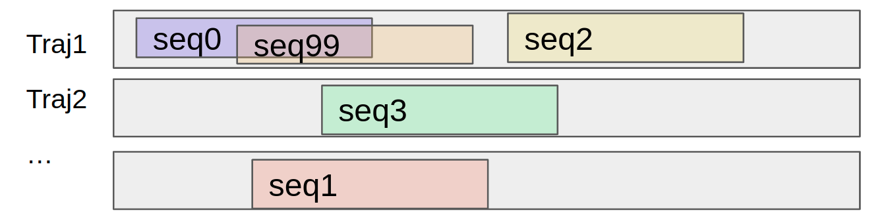
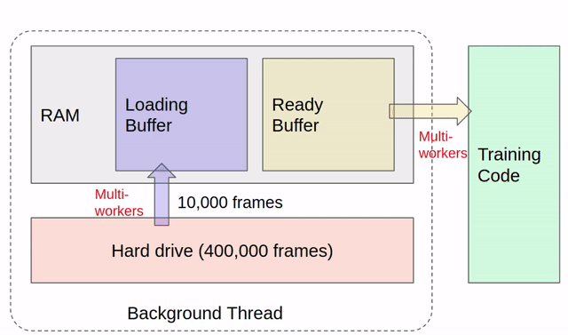
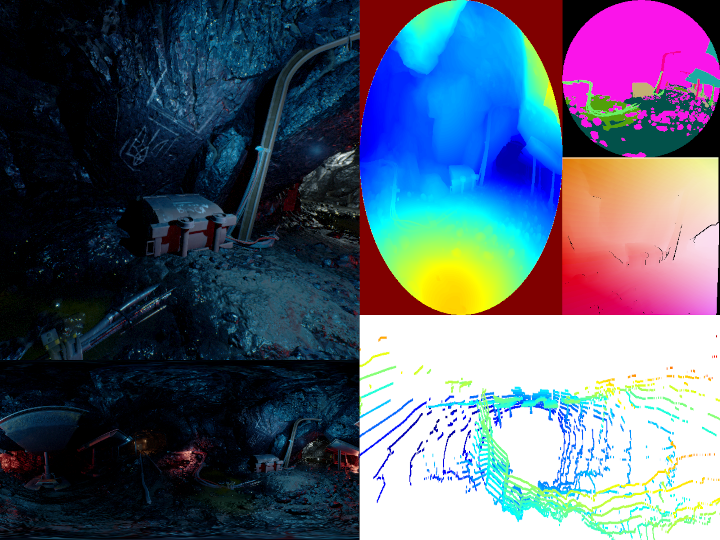

# Loading Multi-Modal Sequential Data
A general and efficient dataloader for TartanAir-style datasets

### Motivation 
Data loading becomes a bottleneck when training a multi-modal sequential model. For example, training a sequential [TartanVO](https://github.com/castacks/tartanvo) model needs to load RGB and flow images. With a batchsize of 64 and a sequence length of 100, each iteration requires 64000 RGB images and 64000 flow images. Although the loading speed can vary a lot on different devices, loading such a large number of images is generally a big challenge as shown in the following table. Even if accelerated using multiple workers, it is still far from satisfactory. In addition, the loading speed doesn't necessarily grow with the worker number depending on the type of storage. 


Time of loading 64K images (s)  | Load RGB | Load flow | Total time |
------------------------------- | -------- | --------- | ---------- |
Desktop w/ SSD                  |    7     |    36     |     43     |
Cluster w/ mechanical harddrive |    67    |    95     |     162    |
Cluster w/ networked storage    |    20    |    40     |     60     |


### Basic Ideas

When randomly loading sequences from a bunch of trajectories, different sequences might have a large overlap (as in the figure below), which results in loading the same image multiple times. Because the most time-consuming thing is loading data from the storage (SSD, hard drive, or networked storage) to the RAM. The idea to accelerate the loading is to cache a subset of trajectories in RAM, and load sequences from these cached trajectories exclusively before the next cache is loaded. 



This datacacher maintains two buffers in RAM. One is a "loading" buffer, one is a "ready" buffer. Data is loaded alternately to these two buffers in multiple threads. The training code loads data from the ready buffer and will either wait for the next buffer or repetitively train on the current one once all data has been sampled. 

**Note that this datacacher won't help in every case. It only helps when there are lots of repetitive loadings between samples or batches.**

**Note that the datacacher breaks the IID assumption. Depending on the size of your buffer, or whether you allow repetitive sampling, the distribution of your data will be less IID.**



## How to Use
### Prepare Data
This datacacher supports both [TartanAir](https://github.com/castacks/tartanair_tools) and [TartanAir-V2](https://tartanair.org/). The first step is to **download the dataset** and **prepare a datafile**. As an example, download a sample trajectory from TartanAir-V2, using the following command: 
```
wget -O sample_coalmine.zip https://cmu.box.com/shared/static/nt7av69j88e2uge77fxbc9cfw4nnxb0a.zip
```
Extract the zip file to a data_root folder $DATA_ROOT. 

The datafile is a text file that specifies all the data in the form of trajectories. A datafile is in the following format: 

```
coalmine/Data_easy/P000 51 # the relative path of traj0, the length of traj0
000000                     # the next N lines describe the string of each frame
000001
000002
...
N-1
coalmine/Data_easy/P001 1621 # the second trajectory starts 
000000
000001
000002
...
001620
...
```
The datafile for the sample trajectory could be found `$DATA_ROOT/coalmine/analyze/data_coalmine.txt`, which only contains one trajectory. Some simple filtering and data balancing tasks could be achieved by just modifying the datafile without touching the raw data. For example, if frames 10, 25, 40, 41 from the above trajectory are bad, we can filter out those frames, in which case the trajectory is split into 4 shorter trajectories by defining a new datafile `$DATA_ROOT/coalmine/analyze/data_coalmine_filter.txt`

Copy the datafile to `data_cacher/data` before you run the following examples. 

```
cp $DATA_ROOT/coalmine/analyze/data_coalmine.txt ./data_cacher/data/
```

### Use low-level interface DataCacher
The DataCacher maintains two buffers, and loads data constantly to one of the buffers in a background thread. 

```
python -m data_cacher.example_datacacher 
       --data-root $DATA_ROOT
       --data-file data_cacher/data/data_coalmine.txt
```



The above command shows an example of loading multiple modalities into the cacher and visualizing them. The DataCacher allows you to draw samples from the loaded buffer by indexing. The images could be resized according to the task needs before caching to buffer. If the training time (in this case it's visualization) is less than the loading time, it will repeat on the current buffer before the next buffer is loaded. To better see this, turn off the visualization because it is slow. Notice how the repeat number changes before the buffer is loaded. 

```
python -m data_cacher.example_datacacher 
       --data-root $DATA_ROOT
       --data-file data_cacher/data/data_coalmine.txt
       --visualize-off
```

### Use high-level interface MultiDatasets
The MultiDatasets implements the data loader from the RAM to the training/testing batch. The main features are:
- **Sequential Loading** Specify different lengths of sequences for different modalities. Handle skip and stride when sampling subsequences from the trajectories. 
  
  e.g. you can load 1000 frames of IMU, 20 frames of RGB, and 10 frames of depth into one batch of data.  

- **Combine Multiple Datasets** Mix multiple datasets in training and balance the number of samples drawn from each dataset.  

**Example 1 Load Randomly Shuffled Sequences** In the case of loading randomly shuffled sequences for training, the first example loads multiple modalities from two datasets, one defined in `data_coalmine.txt` and the other in `data_coalmine_filter.txt`. 

By design, there are two ways to specify the root directory of each dataset. 
- Open the specification file `data_cacher/dataspec/sample_tartanair_random.yaml`,  change `data_root_path_override` value to the $DATA_ROOT. 
- Alternatively, you can change `DataRoot['local']['tartan2']` in the `data_roots.py` file.  

```
python -m data_cacher.example_multidatasets
       --data-spec data_cacher/dataspec/sample_tartanair_random.yaml
       --shuffle
```

The specification file is used to define how you want the data to be loaded. It is designed to be general and flexible for different use cases. Please take a deep look at the  `sample_tartanair_random.yaml` data spec file. 

Below, we highlight a few interesting features in this example. 
- Global parameters
  
  You could specify common or default parameters under the `global` section to avoid duplication. For example, in the example, `global/modality/length` is set to 1, which means wherever this parameter is not set in the following `data` section, the default value of 1 will be used. 

- Multiple datasets
  
  In this example, we combine the sample dataset `data_coalmine.txt` with the filtered dataset `data_coalmine_filter.txt` together. Samples will be drawn randomly from these two datasets. 

- Balance the dataset size

  Note that the `subset_framenum` of the sample dataset `data_coalmine.txt` is 20 and that of the filtered dataset `data_coalmine_filter.txt` is 100. This encourages it to sample more from the filtered dataset. But it doesn't necessarily mean it samples 5 times more in the filtered dataset. Because the number of sequences that could be sampled from 100 frames also depends on the skip and stride value we will mention below. 

- Skip and stride

  The `skip` and `stride` are used for the sequential sampling from the trajectories. The `skip` defines how many frames will be skipped between two consecutive frames in a sequence. The `stride` defines how many frames will be skipped between two sequences. In the example, the default values are `skip=0`, `stride=1`, which samples most densely from the trajectories. The first dataset sets the `skip=1`, which means the two `img0` images and or other modalities returned in the batch will be two frames apart in the original trajectory. 

**Example 2 Load in Sequential Order from One Trajectory at a Time** In the case of loading data in sequential order for evaluation, the second example loads multiple modalities from two datasets, same as above, but in a trajectory-by-trajectory order. In this setting, the buffer size will change every time it loads the next trajectory. Note that we are loading the entire trajectory into the buffer, so make sure your RAM is big enough with respect to your trajectory length. 

```
python -m data_cacher.example_multidatasets 
      --data-spec data_cacher/dataspec/sample_tartanair_traj.yaml
```

## Under the Hood
Now we talk about the implementation details of this data_cacher, in case people want to support their own dataset or add new functionalities. We first talk about some key components. Then we use KITTI dataset as an example to show how easy it is to add a new dataset.  

### Features and Assumptions 
By design, we make the following assumptions. 
- Data is organized in trajectories
- Each trajectory contains multiple modalities, which are organized in different folders
- Different modalities are temporally aligned. It is only supported that one modality has a higher frequency that is an integral multiple of other modalities. For example, in TartanAir, images are at 10 Hz and IMU is at 100 Hz. 

### Key components
**Data spec file** is used by both low-level interface DataCacher and high-level interface MultiDatasets. It defines what modalities you want to load and how you want to load them (size, length, skip, stride, etc.). It also allows you to load dataset-specific parameters such as camera intrinsics. This file will be parsed by `ConfigParser`. 

```
1:
  file: "$YOURDIR/data/tartan_train.txt"
  modality: 
    "depth_left":
      "depth":
        cacher_size: [160, 120]
        length: 1
    "flow":
      "flow":
        cacher_size: [320, 240]
        length: 1
      "mask":
        cacher_size: [160, 120]
        length: 1
  cacher:
    data_root_key: tartan 
    data_root_path_override: $YOUR_DATA_ROOT
    subset_framenum: 200
    worker_num: 0
    load_traj: false
  dataset:
    frame_skip: 0
    seq_stride: 1
    frame_dir: true
  parameter:
    intrinsics: [640, 640, 320, 320, 320, 320]
    intrinsics_scale: [0.25, 0.25]
    fxbl: 80
```

**DataSplitter** describes how the whole dataset is split into subsets, either depending on the number of frames or by trajectories. 

**TrajBuffer** is the data structure used for organizing the multi-modal data in RAM. It uses `RAMBuffer`, which is based on `multiprocessing.Array` to store data in RAM. 

**modality_type** handles dataset-specific things such as how modalities are organized and how different types of files are loaded. 

## Extend to a New Dataset

1. Download an example KITTI trajectory

```
wget https://cmu.box.com/shared/static/nw3bi7x5vng2xy296ndxt19uozpk64jq.zip -O data/KITTI_10.zip
unzip -q data/KITTI_10.zip -d KITTI_10/
```

2. Add a new script `kitti_types.py` under `modality_type` folder. 

3. Define a data spec file as `dataspec/sample_kitti.py`, and change the `data_root_path_override`. 

4. Run the `MultiDataset`: 
```
python -m data_cacher.example_multidatasets_kitti 
      --data-spec data_cacher/dataspec/sample_kitti.yaml
```
